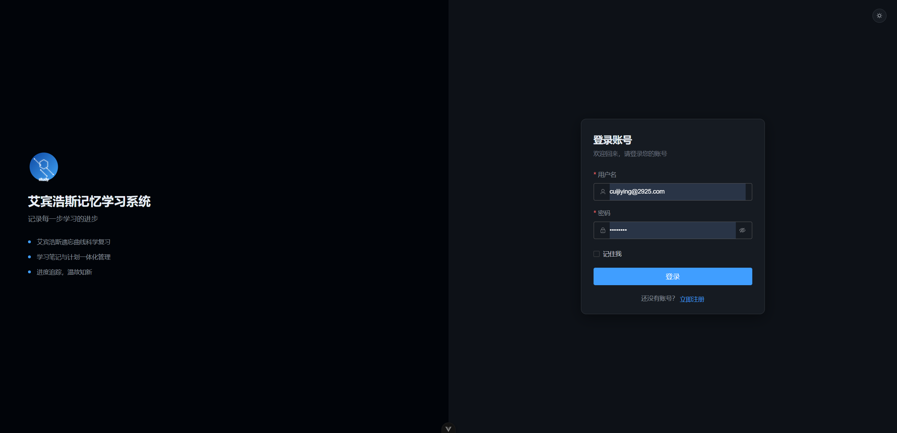

# study-memory

基于 **艾宾浩斯遗忘曲线** 的个人学习记忆系统。本仓库同时是一套 **Vue 3 + Vercel + Supabase** 全栈实践：前端用 Vite 构建 SPA，后端与鉴权全部交给 Supabase，静态资源与 SPA 路由托管在 Vercel。

线上地址：[https://study-memory.vercel.app](https://study-memory.vercel.app)



---

## 1. 项目定位

传统笔记工具只负责「记」，很少管「何时再看」。本系统把学习内容拆成可追踪的复习任务：新增一条笔记时，自动按艾宾浩斯间隔生成 5 次复习时间点；首页汇总今日待复习、已完成与完成率；学习计划、学习类型、问题管理覆盖从规划到复盘的完整闭环。

同时，它刻意做成可复用的工程模板，用来验证以下能力：

- Vue 3 组合式 API + TypeScript 的中大型前端组织方式
- Supabase Auth / PostgREST / 数据库视图的 BaaS 用法
- 无独立 Node 服务时，如何把 SPA 部署到 Vercel 并对接后端

---

## 2. 技术栈一览

| 层级 | 选型 | 在本项目中的职责 |
|------|------|------------------|
| 运行时 | Vue 3.5 + TypeScript | 组合式 API、`<script setup>`、类型约束 |
| 构建 | Vite 6 | 开发热更新、生产打包、路径别名、分包 |
| 路由 | Vue Router 4 | 路由懒加载、`meta` 鉴权、菜单由路由派生 |
| 状态 | Pinia | 认证会话、主题、学习类型缓存 |
| UI | Element Plus + Sass | 按需引入、暗色 CSS Variables、全局 SCSS 变量 |
| 后端 | Supabase | Auth、PostgreSQL、行级过滤、视图联表 |
| 部署 | Vercel | 静态托管、环境变量、SPA fallback |
| 包管理 | pnpm | 依赖安装与脚本执行 |

核心依赖：

```text
vue / vue-router / pinia
element-plus / @element-plus/icons-vue
@supabase/supabase-js
vite / vue-tsc / sass
unplugin-auto-import / unplugin-vue-components
```

---

## 3. 技术栈实践

### 3.1 Vue 3 工程实践

**组合式 API 与分层**

页面只负责交互与展示；数据访问下沉到 `src/services/`，跨页复用逻辑放在 `src/composables/`，领域类型集中在 `src/types/`。典型调用链：

```text
View → composable / store → service → supabase-js → PostgreSQL
```

例如学习笔记页通过 `useAuthUser()` 取得当前用户 ID，再调用 `studyRecordService.list()`；首页统计、今日活动也走同一套 service，避免在多个视图里复制查询。

**路由懒加载与守卫**

所有业务页面均使用动态 `import()`，首屏只加载登录或布局壳。`beforeEach` 会先初始化 Auth Store，再根据 `meta.requiresAuth` 决定放行、跳转登录或把已登录用户从登录页踢回首页。

**自动导入**

Vite 接入 `unplugin-auto-import` 与 `unplugin-vue-components`：

- 自动导入 `vue` / `vue-router` / `pinia` API
- 按需解析 Element Plus 组件与样式（`importStyle: 'sass'`）
- 生产构建不启用 Vue DevTools 插件，减小产物

**打包优化**

`manualChunks` 把 `element-plus` 与 `@supabase/supabase-js` 拆成独立 vendor chunk，页面级路由继续按需加载。开发服务器端口 `8888`，`host: 0.0.0.0`，便于局域网访问。

### 3.2 Pinia 状态实践

| Store | 作用 |
|-------|------|
| `auth` | 缓存 `User`、`userId`、初始化标记；订阅 `onAuthStateChange`；提供 `signOut` |
| `theme` | 深色 / 浅色皮肤，写入 `localStorage`，同步 `html[data-theme]` 与 `html.dark` |
| `learningType` | 学习类型 CRUD 与列表缓存，笔记 / 计划页共用 |

认证只初始化一次：路由守卫与 `App.vue` 共用 `initialized` 标记，避免重复 `getUser()`。主题在 `index.html` 内联脚本中提前应用，减少首屏闪白 / 闪黑。

### 3.3 Element Plus 与主题实践

系统提供两套皮肤，**默认深色**，可随时切回浅色：

- 登录 / 注册页右上角太阳 / 月亮按钮
- 主布局顶栏按钮
- 用户下拉菜单「切换浅色 / 深色皮肤」

实现要点：

1. 引入 Element Plus 官方暗色变量：`element-plus/theme-chalk/dark/css-vars.css`
2. 在 `src/styles/theme.css` 定义应用级 CSS 变量（背景、文字、侧栏、卡片、复习高亮）
3. `html` 同时维护 `data-theme` 与 `class="dark"`，分别驱动自定义变量和 Element Plus 暗色
4. 页面容器使用 `page-panel` 等语义 class，避免硬编码 `#fff` / `#f0f2f5`

登录与注册共用 `AuthShell`：左侧品牌区 + 右侧表单，窄屏自动变为上下布局。

### 3.4 Supabase 实践

本项目**没有自建 API 服务**。浏览器通过 `@supabase/supabase-js` 直连 Supabase：

| 能力 | 用法 |
|------|------|
| Auth | `signInWithPassword` / `signUp` / `signOut` / `getUser` / `onAuthStateChange` |
| 数据 | `.from().select / insert / update / delete`，分页用 `.range()`，筛选用 `.eq / .neq / .or` |
| 联表 | 笔记列表读视图 `study_records_types`，计划列表读 `study_plan_with_type` |
| 多租户 | 笔记与计划查询均带 `user_id`，与当前登录用户绑定 |

客户端只使用 **Publishable Key**（`VITE_SUPABASE_PUBLISHABLE_KEY`），禁止把 service role 密钥打进前端。生产环境建议在 Supabase 开启 **Row Level Security (RLS)**，用 `auth.uid()` 限制读写范围。

环境变量：

```env
VITE_SUPABASE_URL=https://xxxx.supabase.co
VITE_SUPABASE_PUBLISHABLE_KEY=sb_publishable_xxxx
```

本地复制 `.env.example` 为 `.env`。Vercel 在 Project Settings → Environment Variables 中配置同名变量。

### 3.5 Vercel 部署实践

前端 `pnpm build` 产出 `dist/`，由 Vercel 作为静态站点托管。

建议配置：

| 项 | 值 |
|----|----|
| Framework Preset | Vite |
| Build Command | `pnpm build` |
| Output Directory | `dist` |
| Install Command | `pnpm install` |

SPA 注意事项：Vue Router 使用 `createWebHistory`，刷新 `/study-notes` 等深层路径需要回退到 `index.html`。Vite 预设通常已处理；若出现 404，在项目根目录增加 `vercel.json`：

```json
{
  "rewrites": [{ "source": "/(.*)", "destination": "/index.html" }]
}
```

部署链路：

```text
Git Push → Vercel Build (Vite) → dist 静态资源 → CDN
浏览器 ⇄ Supabase Auth / REST（数据与登录不经过 Vercel Functions）
```

这是典型的 **Jamstack + BaaS**：Vercel 只负责前端，业务数据与会话在 Supabase。

---

## 4. 系统应用

### 4.1 艾宾浩斯复习模型

新增学习笔记时，以当前时间为起点，按小时偏移生成 5 次复习：

| 次数 | 间隔 | 含义（约） |
|------|------|------------|
| 第 1 次 | 3 小时 | 当天巩固 |
| 第 2 次 | 27 小时 | 次日复习 |
| 第 3 次 | 72 小时 | 第 3 天 |
| 第 4 次 | 7 天 | 一周后 |
| 第 5 次 | 15 天 | 半月后 |

状态字段 `review_status` 为长度为 5 的 `0/1` 字符串，例如 `01000` 表示第二次已完成。点击对应圆点可将该次标记为已复习（已完成不可回退）。首页按当天时间窗口统计「今日需复习 / 已完成 / 未完成 / 完成率」。

间隔常量定义在 `src/utils/date.ts` 的 `REVIEW_INTERVALS_HOURS`。

### 4.2 功能模块

**认证**

- 邮箱 + 密码注册 / 登录（注册走 `signUp`，可按项目设置要求邮箱验证）
- 未登录访问业务页跳转 `/login`；已登录访问登录 / 注册跳转首页
- 顶栏展示当前邮箱，支持查看注册时间、最后登录时间，以及退出

**首页**

- 今日复习任务统计卡片
- 今日新增笔记、状态更新时间线
- 数据按当前用户过滤

**学习笔记**

- 按学习类型、复习完成状态筛选
- 分页列表；复习日高亮（待复习红、已完成绿）
- 新增时自动写入 5 个复习时间点
- 编辑标题 / 描述 / 链接 / 类型；删除前确认

**学习计划**

- 绑定学习类型、优先级（紧急 / 高 / 中 / 低）、状态（未开始 / 进行中 / 已完成）
- 支持单元号、周次录入，列表按单元树形分组展示
- 计划前复选框快速标记完成 / 待完成
- 支持按学习类型、状态、优先级、单元、周次筛选
- 起止时间 CRUD

**学习类型**

- 分类字典（如前端、算法、英语），供笔记与计划下拉选择

**问题管理**

- 记录学习或开发中的问题：类型、优先级、状态
- 支持原因、解决方案、预防措施、解决时间
- 列表与详情页分离（`/issues`、`/issues/:id`）

### 4.3 页面与路由

| 路径 | 名称 | 说明 |
|------|------|------|
| `/login` | 登录 | 无需登录 |
| `/register` | 注册 | 无需登录 |
| `/` | 首页 | 今日复习概览 |
| `/study-notes` | 学习笔记 | 艾宾浩斯核心 |
| `/study-plan` | 学习计划 | 计划跟踪 |
| `/learning-types` | 学习类型 | 分类管理 |
| `/issues` | 问题管理 | 问题列表 |
| `/issues/:id` | 问题详情 | 不出现在侧栏 |

侧栏菜单由布局路由的 `children` 自动生成，`meta.hideInMenu` 的路由不展示。

### 4.4 数据模型（Supabase）

以下为前端实际读写的表 / 视图，可在 Supabase Table Editor 中对照：

**`study_records`**（学习笔记）

| 字段 | 说明 |
|------|------|
| id | 主键 |
| user_id | 所属用户 |
| title / description / link | 内容 |
| learning_type_id | 学习类型 |
| review1_time … review5_time | 五次复习时间（ISO） |
| review_status | 如 `00000` / `11111` |
| created_at / updated_at | 时间戳 |

**`study_records_types`**：笔记 + 类型名称的视图，列表页使用。

**`study_plan`** / **`study_plan_with_type`**：计划主表与带类型名的视图；含 `title`、`description`、`start_time`、`end_time`、`status`（`not_started` / `in_progress` / `completed`）、`priority`（`low` / `medium` / `high` / `urgent`）、`unit_number`、`week_number`、`learning_type_id`、`user_id`；视图额外提供 `learning_type_name`、`learning_type_description`。

**`learning_types`**：`id`、`name`、`description`。

**`issues`**：`issue_id`、`title`、`issue_type`、`description`、`status`、`priority`、`solution`、`cause`、`preventive_measures`、`resolution_time`。

Auth 用户由 Supabase Auth 管理，业务表通过 `user_id` 关联 `auth.users`。

---

## 5. 目录结构

```text
study-memory/
├── index.html                 # 主题防闪烁内联脚本
├── vite.config.ts
├── env.d.ts
├── .env.example
├── src/
│   ├── main.ts                # Pinia / Router / 主题预初始化
│   ├── App.vue
│   ├── lib/supabase.ts        # 单一 Supabase 客户端
│   ├── router/index.ts
│   ├── stores/                # auth / theme / learningType
│   ├── services/              # 笔记、计划、问题
│   ├── composables/           # useAuthUser / useTableHeight
│   ├── utils/date.ts          # 艾宾浩斯间隔与日期工具
│   ├── types/
│   ├── layouts/DefaultLayout.vue
│   ├── components/            # AuthShell、ThemeToggle
│   ├── views/
│   ├── styles/theme.css
│   └── assets/
└── dist/                      # Vercel 发布产物
```

---

## 6. 本地开发

### 环境要求

- Node.js 22+（与 `@tsconfig/node22` 对齐）
- pnpm

### 推荐编辑器

[VS Code](https://code.visualstudio.com/) + [Volar](https://marketplace.visualstudio.com/items?itemName=Vue.volar)（请禁用 Vetur）。`.vue` 的类型检查使用 `vue-tsc`，不要直接用 `tsc`。

### 安装与启动

```sh
pnpm install
cp .env.example .env   # 填入 Supabase URL 与 Publishable Key
pnpm dev               # http://localhost:8888
```

### 常用脚本

```sh
pnpm type-check   # vue-tsc --build
pnpm build        # 生产构建
pnpm preview      # 预览 dist
```

### 联调注意

1. 在 Supabase 打开 Email 登录，按需开启邮箱确认。
2. 为业务表配置 RLS，策略中使用 `auth.uid() = user_id`。
3. 视图 `study_records_types`、`study_plan_with_type` 需包含列表所需字段（含类型 `learning_type_name`）。
4. 前端仅暴露 Publishable Key；密钥轮换后同步更新本地 `.env` 与 Vercel 环境变量。

---

## 7. 实践小结

这条技术链路的价值在于：**前端专注交互与领域模型，后端能力用托管服务拼装**。

- Vue 3 负责组件化、路由权限、主题与打包体积
- Supabase 负责账号、会话、PostgreSQL 与即时查询
- Vercel 负责全球 CDN 与 Git 驱动的持续部署

适合作为个人工具上线，也适合作为 Vue + BaaS 的参考实现。后续可在不改前端架构的前提下扩展：Supabase Realtime 同步复习状态、Edge Functions 做定时提醒、Storage 挂学习附件等。
